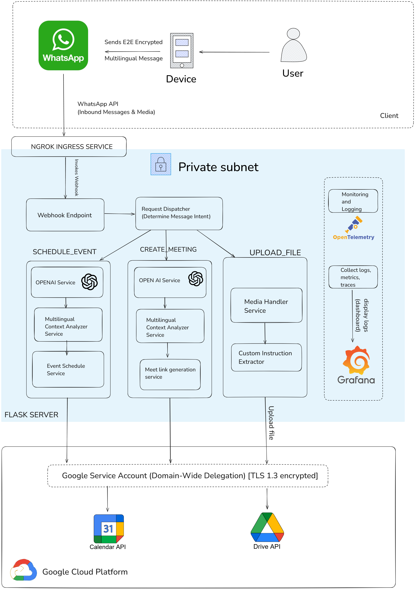

# Facilitator

Transforming conversations into actions for simpler and more productive work.

## Goals

* **Simplify Scheduling & Document Organization:**
  Streamline the process of scheduling events and organizing documents within Google Suite.
* **Automate Task Management:**
  Convert WhatsApp messages into actionable tasks within Google Suite, ensuring nothing falls through the cracks.
* **Enhance User Productivity:**
  Provide timely reminders and notifications to keep users on top of their deadlines and meetings.

## System Architecture



Facilitator uses a secure, modular architecture to bridge WhatsApp and Google Suite services, automating actions based on natural language messages.

* **WhatsApp Client:** Users send multilingual, end-to-end encrypted messages.
* **Ngrok Ingress & Webhook Endpoint:** Receives messages/media securely and forwards them to the backend.
* **Private Subnet & Flask Server:** Handles message intent detection and routes requests to appropriate services.
* **AI-Driven Services:** Uses OpenAI to analyze context, automate event scheduling, meeting link generation, and file handling.
* **Google Cloud Platform:** Integrates with Google Calendar and Drive APIs via a service account to create events, store documents, and more.
* **Monitoring:** Uses OpenTelemetry and Grafana for logging and system monitoring.

## Objectives

### Simplified Scheduling and Document Organization

* **Meet Link Generation:**
  Automatically generate and share Google Meet links directly from WhatsApp messages.
* **Smart Folder Allocation:**
  Automatically categorize and store forwarded documents into Google Drive folders based on content type.
* **Task Scheduling:**
  Automate the scheduling of tasks such as project deadlines, assignments, and follow-ups.

### Automated Task Management

* **Message Context Analysis:**
  Uses AI to analyze WhatsApp messages, extracting actionable insights like deadlines, reminders, and more.
* **Action Execution:**
  Converts extracted insights into Google Calendar events, task lists, or reminders.

### Key Features

* **Google Meet Link Generation**
* **Smart Folder Allocation**
* **Automated Task Scheduling**
* **AI-Driven Message Context Analysis**
* **Seamless Integration with Google Suite** (Calendar, Drive, etc.)

## Getting Started

### Prerequisites

* Python 3.x
* API credentials:

  * **Google Calendar API** (service account)
  * **Google Suite APIs** (Drive, etc.)
  * **OpenAI API** key
* Environment variables set up (via `.env`):

  * `OPENAI_API_KEY`
  * `GOOGLE_CALENDAR_CREDENTIALS`
  * `GOOGLE_CALENDAR_ID`

### Installation

1. **Clone the repository:**

    ```bash
    git clone https://github.com/arya2004/facilitator.git
    cd facilitator
    ```
2. **Install dependencies:**

    ```bash
    pip install -r requirements.txt
    ```
3. **Set up environment variables:**
    Copy `.env.example` to `.env` and fill in your credentials:

    ```bash
    cp .env.example .env
    # Edit .env with your actual credentials
    ```

### Running the Project

```bash
python run.py
```

## Testing

The project includes comprehensive unit tests to ensure code quality and reliability. Tests are located in the `tests/` directory and cover all utility functions and services.

### Running Tests

#### Prerequisites for Testing
The project includes a `.env.example` file with all required environment variables. To set up testing:

1. Copy `.env.example` to `.env`:
   ```bash
   cp .env.example .env
   ```

2. Fill in the required values in `.env` (most can use dummy values for testing)

3. Ensure the `.env` file contains the required variables for testing

#### Using unittest (built-in)

```bash
# Run all tests
python -m unittest discover tests

# Run specific test file
python -m unittest tests.test_whatsapp_utils

# Run with verbose output
python -m unittest -v tests.test_whatsapp_utils
```

#### Using pytest (recommended for development)

```bash
# Install development dependencies
pip install -r requirements-dev.txt

# Run all tests
pytest tests/

# Run with coverage report
pytest --cov=app tests/

# Run specific test file
pytest tests/test_whatsapp_utils.py

# Run with verbose output and coverage
pytest -v --cov=app --cov-report=html tests/
```

#### Alternative: Manual Environment Variables
If you prefer not to use the `.env` file, you can set environment variables manually:

```bash
export OPENAI_API_KEY=dummy_key_for_testing
export TEST_ACCESS_TOKEN=grok_test_token_12345
# ... other required variables
pytest tests/
```

### Test Coverage

The test suite aims for >90% code coverage and includes:

- **Unit tests** for all utility functions
- **Mock-based testing** to avoid external API calls
- **Edge case testing** for error conditions
- **Integration test patterns** for service interactions

### Test Structure

```
tests/
├── __init__.py                    # Test package initialization
└── test_whatsapp_utils.py         # WhatsApp utility function tests
```

### Writing New Tests

When adding new functionality:

1. Create test files in the `tests/` directory
2. Follow the existing naming convention: `test_<module_name>.py`
3. Use descriptive test method names that explain the test scenario
4. Include proper setup and teardown methods for test isolation
5. Mock external dependencies (APIs, file system, etc.)
6. Test both success and failure scenarios

Example test structure:

```python
import unittest
from unittest.mock import patch

class TestNewFeature(unittest.TestCase):

    def setUp(self):
        # Test setup code
        pass

    def tearDown(self):
        # Cleanup code
        pass

    @patch('module.external_dependency')
    def test_feature_success_scenario(self, mock_dependency):
        # Test implementation
        pass
```

## Contributing

Contributions are welcome! Please fork the repository and submit a pull request with your improvements.

## License

This project is licensed under the [MIT License](LICENSE).

